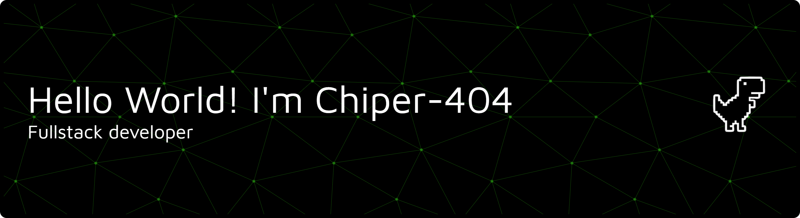

<p align="center">
  
</p>

<p align="center">
  
</p>

<div align="center">

✨ **Welcome to my GitHub Universe!** ✨  
*A passionate developer who loves to build, learn, and innovate*

[](https://github.com/Cipher-4O4)
[](https://github.com/Cipher-4O4)
[](https://github.com/Cipher-4O4)
[](https://github.com/Cipher-4O4)

</div>

---


## 🛠️ Tech Stack & Tools

### 💻 Programming Languages


### ⚡ Backend Development


### 🎨 Frontend Development


### 🗄️ Databases


### ☁️ Cloud & DevOps


### 🛠️ Tools & Platforms


---

## 📈 GitHub Analytics

<div align="center">
  
  
</div>

<div align="center">
  
</div>

<div align="center">
  
</div>


---

## 🌟 Current Projects

### 🔭 Working On

| Project | Description |
|---------|-------------|
| **Family Laundry System 🧺** | A complete laundry management solution<br>**Tech Stack:** Node.js, Express, MySQL, React<br>**Features:** Inventory management, billing, customer tracking<br>**Status:** 🚧 In Development |
| **AI-Powered Web Apps 🤖** | Exploring AI integration in web applications<br>**Tech Stack:** Python, FastAPI, React, TensorFlow<br>**Features:** Machine learning models, real-time predictions<br>**Status:** 🔬 Research & Development |

---

## 🌱 Learning & Exploring

- **Flutter & Dart 📱** - Mobile app development
- **Kubernetes & DevOps ⚙️** - Container orchestration
- **GraphQL 📊** - Modern API development
- **Web3 & Blockchain 🔗** - Decentralized applications

---

## 🏆 Achievements & Highlights

<div align="center">
  
  
  
</div>

---

## 🤝 Let's Collaborate!

### 👯 Looking to collaborate on:
- Open-source web applications
- AI/ML integration projects
- Full-stack development
- Automation tools and scripts

### 🤔 Need help with:
- Complex backend architectures
- Database optimization
- Deployment strategies
- Code reviews and best practices

---

## 📫 Connect With Me

<div align="center">
  <a href="mailto:your-email@example.com"></a>
  <a href="https://linkedin.com/in/cipher-4o4"></a>
  <a href="https://instagram.com/cipher-4o4"></a>
  <a href="https://twitter.com/cipher-4o4"></a>
  <a href="https://discord.com/users/your-discord-id"></a>
  <a href="https://t.me/cipher4o4"></a>
</div>

---

## 🎯 Programming Activity

<div align="center">
  
</div>

---

## 📊 Weekly Development Breakdown

<!--START_SECTION:waka-->
```
JavaScript    ████████████████████▓░░░░   78.5%
HTML/CSS      ██████▓░░░░░░░░░░░░░░░░░░   23.4%
Python        ████▒░░░░░░░░░░░░░░░░░░░░   15.2%
SQL           ██▓░░░░░░░░░░░░░░░░░░░░░░   8.7%
Other         █▒░░░░░░░░░░░░░░░░░░░░░░░   3.2%
```
<!--END_SECTION:waka-->

---

## ✨ Fun Facts & Trivia

<div align="center">
  
  
  
  
</div>

---

## 📌 Pinned Repositories

<div align="center">
  <a href="https://github.com/Cipher-4O4/family-laundry">
    
  </a>
  <a href="https://github.com/Cipher-4O4/awesome-project">
    
  </a>
</div>

---

<div align="center">

### 🚀 Ready to Build Amazing Things Together!
⭐ **Star my repositories if you find something interesting!** ⭐

<a href="https://www.buymeacoffee.com/cipher4o4">
  
</a>
<a href="https://github.com/sponsors/Cipher-4O4">
  
</a>

**Thanks for visiting! Have a great day!** 😄

<p align="center">
  
</p>

</div>
<!--END_SECTION:waka-->
